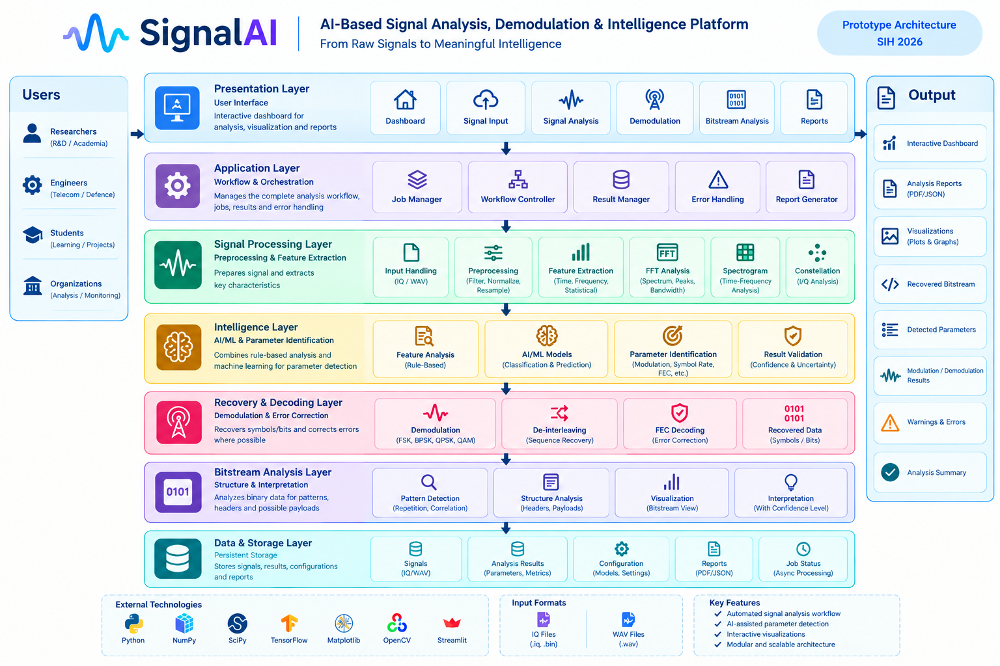

# SignalAI — AI-Based Signal Analysis, Demodulation & Intelligence Platform

> A UI prototype for automating the analysis of **.IQ and .WAV signal files**, extracting signal parameters, performing demodulation and decoding, and providing interactive bitstream intelligence.

---

## Overview

**SignalAI** is a **Smart India Hackathon (SIH) 2026** prototype that demonstrates an automated workflow for analysing IQ and WAV signal recordings.

The platform is designed to reduce the manual effort involved in identifying signal characteristics, extracting parameters, analysing modulation, recovering data, and interpreting decoded bitstreams.

Instead of performing each analysis step manually, the prototype illustrates how technicians, researchers, students, and signal-processing engineers can follow a structured digital workflow from **signal input → analysis → demodulation → decoding → bitstream analysis → report generation**.

> **This repository showcases the UI prototype and proposed user journey. It is intended to demonstrate the proposed solution and workflow rather than a complete production implementation.**

---

## SIH Problem Statement

**Problem Statement ID:** SIH26147

**Title:** Automated model for analysis of .IQ and .wav files along with signal parameter extraction

**Theme:** Miscellaneous

**Category:** Software

**Team:** TEAM HEXA 1

---

## Interactive Prototype

**Figma Prototype:**

> https://easing-theory-64388622.figma.site/

---

## Problem Statement

Signal analysis of IQ and WAV recordings can involve multiple manual steps, including:

* Processing raw signal recordings
* Identifying signal characteristics
* Extracting signal parameters
* Determining modulation type
* Estimating sampling and symbol rates
* Identifying FEC and interleaving characteristics
* Performing demodulation
* Recovering and analysing bitstreams
* Interpreting the resulting data

These steps can become difficult when signals contain noise, interference, unknown parameters, or large amounts of recorded data.

The SIH problem focuses on developing an automated model capable of analysing **.IQ and .WAV files** and extracting important signal parameters.

---

## Proposed Solution

SignalAI demonstrates a structured analysis workflow where users can:

* Upload IQ or WAV signal files
* Read available signal metadata
* Preprocess and normalize the signal
* Extract signal features
* Visualize waveforms and frequency characteristics
* Identify important signal parameters
* Analyse modulation characteristics
* Perform demodulation
* Apply de-interleaving and FEC decoding where supported
* Analyse recovered bitstreams
* Generate a structured analysis report

The proposed workflow combines **signal-processing techniques with AI-assisted analysis** to support automated parameter identification and signal understanding.

---

## SignalAI Workflow

**Signal Input → Preprocessing → Feature Extraction → Parameter Identification → Modulation Analysis → Demodulation → De-interleaving → FEC Decoding → Bitstream Analysis → Visualization → Report**

### Workflow Diagram


---

## Architecture

SignalAI follows a modular architecture consisting of:

```text
Signal Input
     ↓
Preprocessing
     ↓
Feature Extraction
     ↓
AI-Assisted Parameter Identification
     ↓
Modulation Analysis
     ↓
Demodulation
     ↓
De-interleaving
     ↓
FEC Decoding
     ↓
Bitstream Analysis
     ↓
Visualization & Reporting
```

### Architecture Diagram



---

## Prototype Screens

### Dashboard


The dashboard provides an overview of the signal-analysis workflow and available analysis modules.

---

### Signal Input


Users can upload supported **IQ/WAV signal files** and inspect available signal metadata.

---

### Signal Analysis


The signal-analysis interface demonstrates waveform, frequency-domain, spectrogram, and constellation visualizations.

---

### Parameter Identification


The prototype displays extracted or estimated signal parameters such as:

* Modulation type
* Sampling rate
* Symbol rate
* FEC
* Interleaving
* Other signal characteristics

---

### Demodulation


The demodulation interface demonstrates supported modulation-analysis workflows such as:

* FSK
* BPSK
* QPSK
* QAM

---

### Bitstream Analysis


Recovered data can be inspected for:

* Binary patterns
* Repeated sequences
* Possible headers
* Payload structures
* Correlations
* Bitstream visualizations

---

### Reports


The report interface demonstrates how the overall analysis results can be presented in a structured format.

---

## Screen Summary

| Screen                   | Purpose                                           |
| ------------------------ | ------------------------------------------------- |
| Dashboard                | Overview of the complete signal-analysis workflow |
| Signal Input             | Upload IQ/WAV files and inspect metadata          |
| Signal Analysis          | Visualize and analyse signal characteristics      |
| Parameter Identification | Display extracted or estimated signal parameters  |
| Demodulation             | Perform modulation-specific signal recovery       |
| Bitstream Analysis       | Analyse recovered binary data and patterns        |
| Reports                  | Present analysis results in a structured report   |

---

## Key Features

### Signal Input

* IQ file support
* WAV file support
* Signal metadata extraction
* Input validation

### Signal Processing

* Signal filtering
* Normalization
* Feature extraction
* FFT analysis
* Spectrogram generation
* Constellation visualization

### AI-Assisted Analysis

* Modulation identification
* Signal parameter estimation
* Feature-based classification
* Hybrid rule-based + ML analysis

### Demodulation & Decoding

* FSK
* BPSK
* QPSK
* QAM
* De-interleaving
* FEC decoding

### Bitstream Intelligence

* Pattern detection
* Correlation analysis
* Header identification
* Possible payload identification
* Binary visualization

### Reporting

* Analysis summary
* Extracted parameters
* Visualization results
* Demodulation results
* Bitstream analysis results

---

## Technology Stack

| Area              | Technologies      |
| ----------------- | ----------------- |
| Programming       | Python            |
| Signal Processing | NumPy, SciPy      |
| AI / ML           | TensorFlow        |
| Visualization     | Matplotlib        |
| Image Processing  | OpenCV            |
| Prototype UI      | Streamlit / PyQt  |
| Development       | VS Code / Jupyter |
| Input             | IQ / WAV          |

The proposed technical approach and technology stack are based on the SIH submission concept.

---

## Prototype Workflow

```text
┌──────────────────────┐
│   IQ / WAV Upload    │
└──────────┬───────────┘
           ↓
┌──────────────────────┐
│    Preprocessing     │
│ Filter / Normalize   │
└──────────┬───────────┘
           ↓
┌──────────────────────┐
│  Feature Extraction  │
│ Time / Frequency     │
└──────────┬───────────┘
           ↓
┌──────────────────────┐
│ Parameter Detection  │
│ Modulation / Rate    │
│ FEC / Interleaving   │
└──────────┬───────────┘
           ↓
┌──────────────────────┐
│     Demodulation     │
│ FSK / PSK / QAM      │
└──────────┬───────────┘
           ↓
┌──────────────────────┐
│ De-interleaving /    │
│    FEC Decoding      │
└──────────┬───────────┘
           ↓
┌──────────────────────┐
│  Bitstream Analysis  │
│ Patterns / Headers   │
│ Possible Payload     │
└──────────┬───────────┘
           ↓
┌──────────────────────┐
│ Visualization &      │
│      Reports         │
└──────────────────────┘
```

---

## Repository Structure

```text
SignalAI/
│── README.md
│── LICENSE
│
├── prototype/
│   ├── README.md
│   ├── dashboard.png
│   ├── signal-input.png
│   ├── signal-analysis.png
│   ├── parameter-identification.png
│   ├── demodulation.png
│   ├── bitstream-analysis.png
│   └── reports.png
│
├── docs/
│   ├── problem-statement.md
│   ├── technical-approach.md
│   ├── architecture.md
│   └── workflow.md
│
├── assets/
│   ├── architecture.png
│   └── workflow.jpeg
│
└── LICENSE
```

---

## Design Goals

The prototype focuses on demonstrating:

* A clean signal-analysis interface
* Guided analysis workflow
* Interactive signal visualization
* Automated parameter identification
* Modulation analysis
* Demodulation and decoding workflow
* Bitstream inspection
* Structured result presentation
* Clear separation between confirmed, estimated, and experimental results

---

## Innovation

SignalAI combines multiple stages of signal analysis into a single workflow.

### Key Innovation Areas

* **Unified IQ/WAV analysis**
* **AI-assisted parameter identification**
* **Hybrid rule-based + ML analysis**
* **Integrated demodulation and decoding**
* **Bitstream-level analysis**
* **Interactive visualization**
* **End-to-end signal analysis workflow**

The proposed solution is intended to reduce manual effort and improve visibility across the signal-analysis process.

---

## Future Scope

The prototype can be extended with:

* Advanced modulation classification
* Real-time signal processing
* Software Defined Radio integration
* GPU-accelerated processing
* Advanced noise and interference handling
* Additional FEC algorithms
* Automatic protocol identification
* Advanced bitstream intelligence
* Large-scale signal processing
* Cloud-based signal analysis
* API-based analysis services
* Advanced AI/ML models
* Automated report generation

---

## Prototype Disclaimer

> **SignalAI is currently a prototype / concept demonstration for Smart India Hackathon 2026.**
>
> The displayed parameters, predictions, confidence values, demodulation results, and decoded outputs should be treated as **experimental unless validated against actual signal data**.
>
> The prototype UI demonstrates the proposed workflow and system design and does not represent a complete production-grade signal-analysis system.

---

## Developed For

**Smart India Hackathon (SIH) 2026**

**Problem Statement ID:** SIH26147

**Problem:** Automated model for analysis of .IQ and .wav files along with signal parameter extraction

**Team:** TEAM HEXA 1

---

## Vision

SignalAI aims to provide a structured platform that transforms complex raw signal recordings into understandable signal characteristics, recovered data, and actionable analysis results.

```text
RAW SIGNAL
    ↓
UNDERSTAND
    ↓
ANALYSE
    ↓
RECOVER
    ↓
INTERPRET
```

> **Analyze. Understand. Recover. Discover.**
